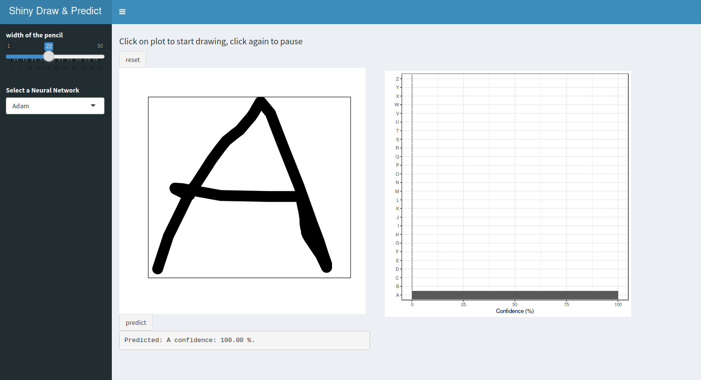
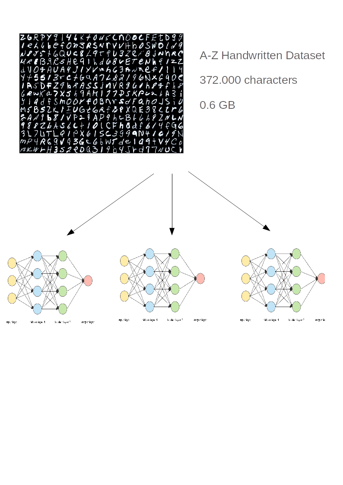
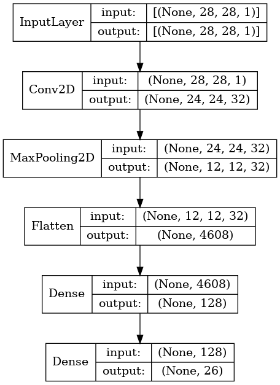
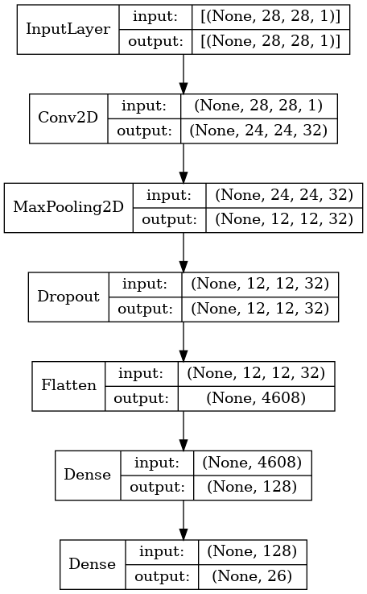
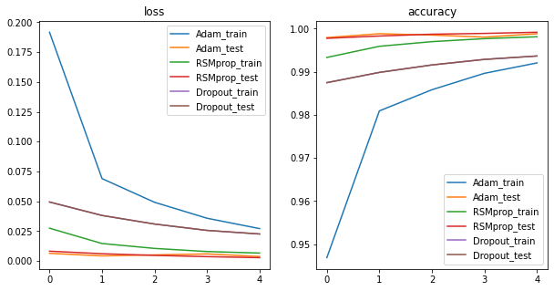
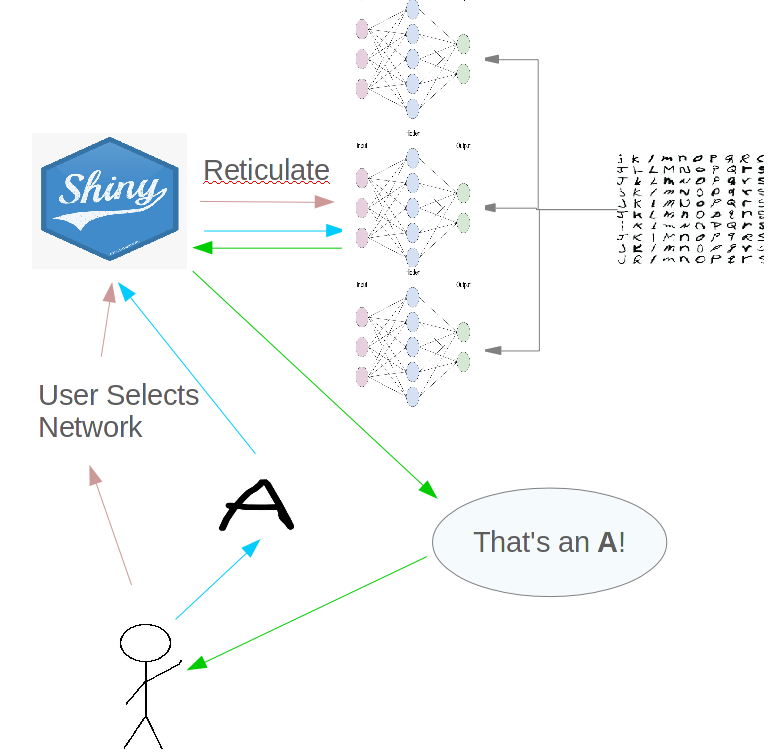

```{r setup, include=FALSE}
options(htmltools.dir.version = FALSE)
```


class: center, middle




---
class: inverse, center, middle

# Try it yourself!

---

# How to access to the app?

Install the app from [Github](https://github.com/svalvaro/ShinyDraw):

```{r eval=FALSE, tidy=FALSE}
remotes::install_github("svalvaro/ShinyDraw")
```

--

Access to https://svalvaro.shinyapps.io/ShinyDraw/
(Fix deployment)


---


class: inverse, center, middle

# How does it work?

---


```{r training, echo=FALSE, out.width="80%"}




```


---


```{r ANN1, echo=FALSE, out.width="50%", fig.cap='Adam and RMSprop optimizers'}





```

---


```{r ANN3, echo=FALSE, out.width="50%", fig.cap='Drop out technique = 20%'}





```

---

# Comparisons between models

```{r training_results, echo=FALSE, out.width="100%"}





```


---

```{r scheme, echo=FALSE, out.width="80%"}




```

