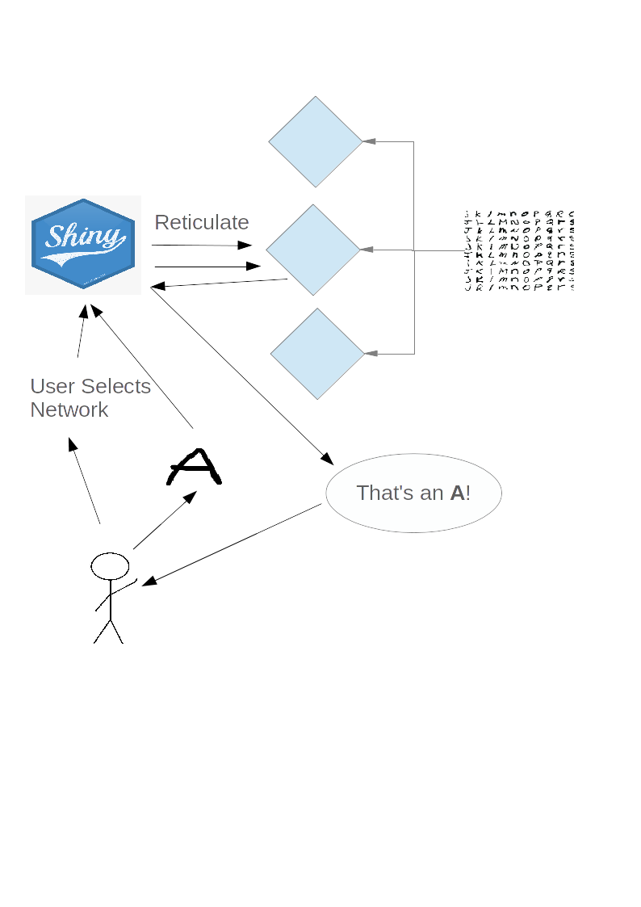

```{r setup, include=FALSE}
options(htmltools.dir.version = FALSE)
```


class: center, middle


---
class: inverse, center, middle

# Try it yourself!

---

# How to access to the app?

Install the app from [Github](https://github.com/svalvaro/ShinyDraw):

```{r eval=FALSE, tidy=FALSE}
remotes::install_github("svalvaro/ShinyDraw")
```

--

Or just access to https://svalvaro.shinyapps.io/ShinyDraw/ 


---
background-image: url(https://i.ytimg.com/vi/Zdf7Afgfq8Q/maxresdefault.jpg)
background-position: 60% 60%
background-size: 100%
class: center, bottom, inverse


---


class: inverse, center, middle

# How does it work?

---


```{r training, echo=FALSE, out.width="80%"}

knitr::include_graphics('images/training.png')


```


---


```{r ANN1, echo=FALSE, out.width="50%", fig.cap='Adam and RMSprop optimizers'}


knitr::include_graphics('images/ANN1.png')


```

---


```{r ANN3, echo=FALSE, out.width="50%", fig.cap='Drop out technique = 20%'}


knitr::include_graphics('images/CNN2_dropout.png')


```

---

# Comparisons between models


---

```{r scheme, echo=FALSE, out.width="80%"}




```

